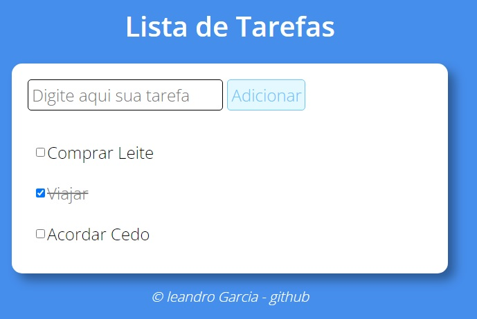

# Lista de Tarefas

Neste projeto, vou criar uma lista de tarefas

## Instruções

1. Criado um campo de `input` de texto e um botão para adicionar a tarefa à lista;
2. Quando o botão for pressionado, o texto deve aparecer na lista com um `checkbox` ao lado;
3. Quando o usuário selecionar o checkbox, o item correspondente deve ficar com o texto riscado. _(ex.: ~~tarefa completa~~. resolvido isso com CSS)_

